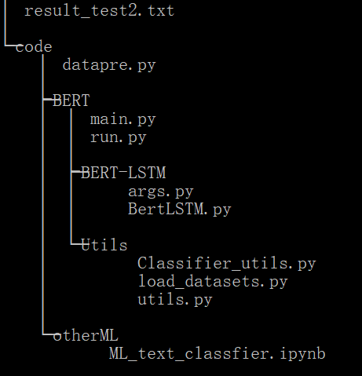
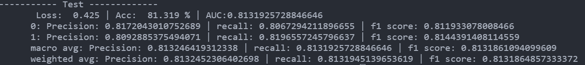

## 机器生成文本的自动识别

### 摘要

​	机器生成文本的自动识别是一个二分类问题。但由于句子长度较长，对分类带来了一些麻烦。我采用BERT+双向LSTM 微调的方式，在测试集1上准确率达到了81.319%，其中人类作者标签的召回率达到了0.8197， 精确率达到0.813， F1得分达到0.814 。

​	我还尝试使用一些基础机器学习模型的方法进行实验，并进行了对比。

​	代码与测试集2 的结果都会提交。

### 实验过程

#### 文件结构




#### BERT + LSTM

模型架构主要是BERT做encoder，经过dropout后传入双向LSTM层，再经过一个分类层得到预测结果。

模型参数：

```
lstm_num_layers = 2
hidden_size = 300
max_seq_length = 500
warmup_propertion = 0.1
learning_rate = 5e-5
dropout = 0.2
batch_size = 8
其余采取默认参数
```

主要踩的坑：

1. 由于句子长度过长因此需要进行截取句子。而 csv文件读取时 会根据引号来判断是否是一行，因此引号不匹配时会导致多行读到csv文件的一行中。
2. BERT 训练很慢。
3. 根据句子长度来调整batch size，避免内存不够

#### 其他基本机器学习模型

##### 特征工程

我尝试了以下几种构建特征的方法：

1.计数向量作为特征：计数向量是数据集的矩阵表示，其中每行代表来自语料库的文档，每列表示来自语料库的术语，并且每个单元格表示特定文档中特定术语的频率计数

2.TF-IDF向量作为特征：第一部分是计算标准的词语频率（TF），第二部分是逆文档频率（IDF）

​	2.1单个词语级别

​	2.2多个词语级别（N-Gram）

​	2.3词性级别

##### 分类器模型

之后利用前面创建的特征训练分类器，我尝试了以下模型：

1. 朴素贝叶斯分类器

2. 线性分类器

3. 支持向量机（SVM）

4. Bagging Models（随机森林）

5. 浅层神经网络


##### 结果：

他们的结果如下表所示：

|     特征      |     模型     | 准确率  |      |
| :-----------: | :----------: | :-----: | ---- |
|   计数向量    |  朴素贝叶斯  | 0.58956 |      |
| 词级别TF-IDF  |  朴素贝叶斯  | 0.5662  |      |
| n-gram TF-IDF |  朴素贝叶斯  | 0.5792  |      |
|   计数向量    | Logistic回归 |  0.61   |      |
| 词级别TF-IDF  | Logistic回归 |  0.628  |      |
| n-gram TF-IDF | Logistic回归 |  0.585  |      |
| n-gram TF-IDF |  支持向量机  |  0.594  |      |
|   计数向量    |   随机森林   |  0.635  |      |
| 词级别TF-IDF  |   随机森林   |  0.624  |      |
| n-gram TF-IDF | 浅层神经网络 |  0.652  |      |
|               |              |         |      |


##### 最优结果

BERT+LSTM 在测试集 1 上的结果如下，包括人类标签的P、R、F1值：




#### 总结与可行的改进

机器写作肯定会有一部分接近人类水平，因此准确率在80%~90%左右是可以接受的。

长文本、风格分类相对简单的情感分类难度大一些。

可以看到，预训练模型BERT的提出，极大的提高了文本分类的效果，在训练几个epoch之后就达到了最优结果。

可以优化的地方：

1. 对文本进行进一步清理，比如去除一些无关符号等
2. 采取不同的截断方式，比如 头部+尾部
3. 尝试更多训练的超参数
4. 尝试其他改进的BERT模型