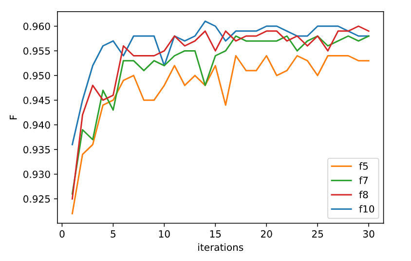
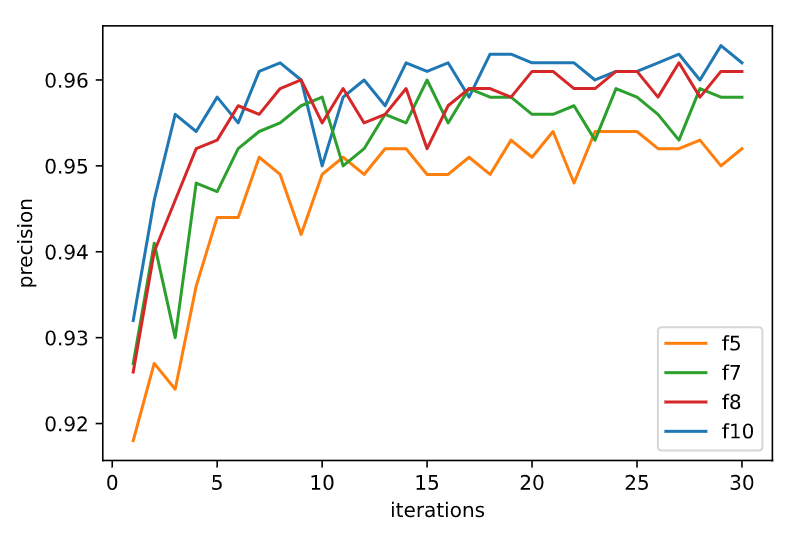
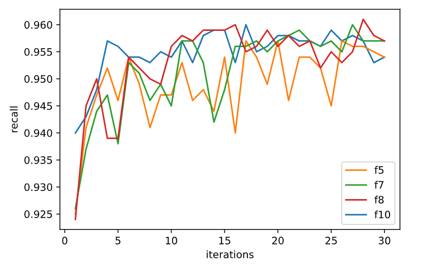
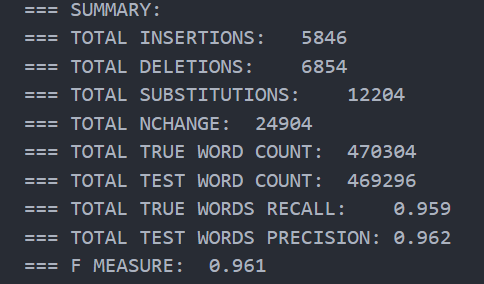

## Chinese segmentation based on structured perceptron

### Abstract

I used the structure perceptron algorithm to do Chinese word segmentation. And I tried using different features and different number of iterations to observe their impact on the results. The best F value reached 0.TODO9xxxxxx.The codes and answers are available in the folder.

### Method

​	According to the requirements of the course, I use the structured perceptron to complete the task of Chinese word segmentation. 

> Structured perceptron algorithm combines the perceptron algorithm for learning linear classifiers with an inference algorithm (classically the Viterbi algorithm when used on sequence data). 
>
> ----- from wikipedia

​	

### Experimental Design

#### Main class: StructuredPerceptronWordSeg

This class is the main class of the experiment. It is the model to train by structured perceptron algorithm which is defined in SPWS.py. 

It has 3 attributes: 

1. featureNum: the number of features we use to describe one character.
2. transitionP: transition probability used in Viterbi algorithm.
3. emissionP: emission probability used in Viterbi algorithm.

and 5 methods:

1. getfeature(): to generate features for the character. We can control the number of features to observe the impact on the model.
2. updateP(): to update the two probabilities mentioned above.
3. train(): predict one sentence's label, and update the probabilities if not match.
4. predict(): predict one sentence's label by using Viterbi algorithm which uses dynamic programming to get the sequence with the highest probability.
5. save(): to save the model by save its 3 attributes as dict.

#### Other functions and details

I use SBME to label sentences. And I use the two functions of xy2oup() and inp2xy() to transform the labeling sequence and the word segmentation sentence.

I tried using 4 kinds of features as listed below: 

1. c[i], c[i-1], c[i+1], c[i-1]c[i], c[i]c[i+1]
2. c[i], c[i-1], c[i+1], c[i-1]c[i], c[i]c[i+1], c[i-2]c[i-1], c[i+1]c[i+2]
3. c[i], c[i-1], c[i+1], c[i-1]c[i], c[i]c[i+1], c[i-2]c[i-1], c[i+1]c[i+2], c[i-1]c[i]c[i+1]
4. c[i], c[i-1], c[i+1], c[i-1]c[i], c[i]c[i+1], c[i-2]c[i-1], c[i+1]c[i+2], c[i-1]c[i]c[i+1], c[i-2]c[i-1]c[i], c[i]c[i+1]c[i+2]

ps: if c[x] not exits, use '*' instead.

#### training method

My code uses python3.6, and I only use 3 libraries: argparse(to use command line), tqdm(to show progress bar) and json(to save and load the model).  And the methods:

--feature(-f): the number of features, default 8

--train(-t): train set file path

--predict(-p): path of the file to predict

-- answer(-a): path of the file to save prediction

--save(-s): path to save the model

--load(-l): path to load the model

--iteration(-i): the number of iterations

### Results and Discussion

I tried using different features and different number of iterations

1. The effect of the number of iterations on the results:

    ​		The change of F-score with the number of iterations and the features：

​				The change of precision with the number of iterations and the features:

​			The change of recall with the number of iterations and the features:

​	

​			We can see that the score increases with the number of iterations, but the increase is not obvious when it is more than 15 iterations. And it is the best that one character has 10 features. Due to time and memory constraints, I did not do more features' experiments. But it can be predicted that the improvement will not be very huge.

2. The best result:

    ​	My best result on dev.txt is: 

​		iterations = 14, featureNum = 10

​		You can get this model just by "bash getbest.sh".

​	After this experiment, I was surprised that the structured perceptron model can get such a high score. I also have a deeper understanding of traditional machine learning.

